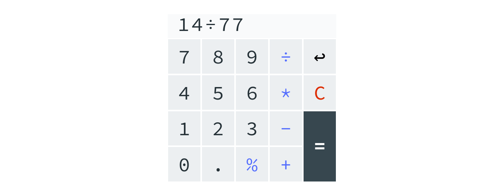

# [JS-Calculator](https://clavierbulb-green.github.io/JS-Calculator/)

---
A simple browser-based calculator app.

Inspired by and written as a solution to the practice project
[Calculator](https://www.theodinproject.com/courses/web-development-101/lessons/calculator) by the Odin Project.

---
## TODO

- [ ] Add support for parentheses
- [ ] Allow for leading sign operators
- [ ] Prettify alert messages
